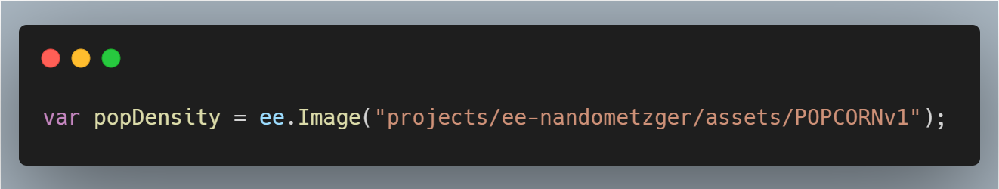
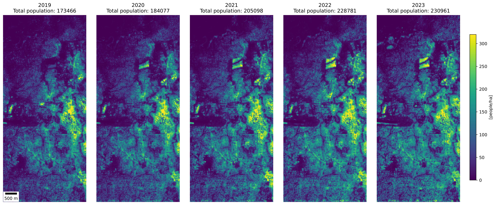
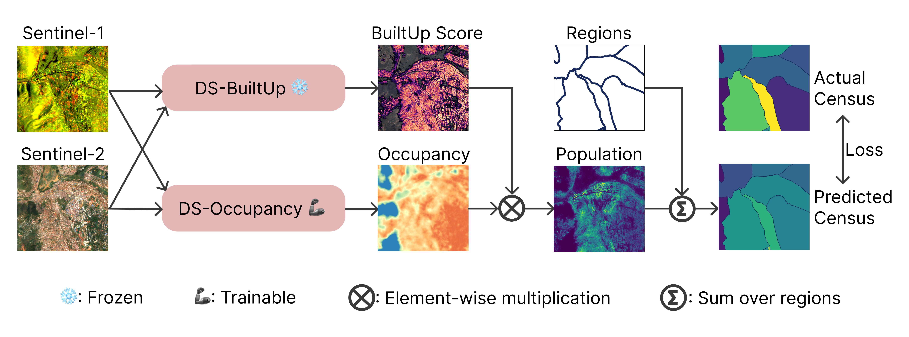

<p align="center">
  
</p>


<h1 align="center">
  🍿POPCORN: High-resolution Population Maps Derived from Sentinel-1 and Sentinel-2 🌍🛰️
</h1>


<p align="center">
    <a href="https://nandometzger.github.io/"><strong>Nando Metzger</strong></a><sup>🏦📧</sup>,
    <a href="https://rcdaudt.github.io/"><strong>Rodrigo Caye Daudt</strong></a><sup>🏦</sup>,
    <a href="https://people.epfl.ch/devis.tuia"><strong>Devis Tuia</strong></a><sup>🍇</sup>,
    <a href="https://igp.ethz.ch/personen/person-detail.html?persid=143986"><strong>Konrad Schindler</strong></a><sup>🏦</sup>
</p>

<p align="center">
  <sup>🏦</sup> Photogrammetry and Remote Sensing, ETH Zürich<br>
  <sup>🍇</sup> Environmental Computation Science and Earth Observation Laboratory, EPFL Sion<br>
  <sup>📧</sup> Corresponding Author: nando.metzger@geod.baug.ethz.ch
</p>


<p align="center">
  <a href="https://popcorn-population.github.io/"></a>
  <a href="https://arxiv.org/abs/2311.14006"></a>
  <a href="https://ee-nandometzger.projects.earthengine.app/view/popcornv1-rwa"></a>
  <a href="https://code.earthengine.google.com/f90c3d3a77ec4dcfeb645457a87ddf48"></a>
  <a href="https://drive.google.com/drive/folders/1BEIrYL-n1lLQ_vvna5r0HRESpLaQMOfT?usp=drive_link"></a>
  <a href="https://github.com/jvargasmu/population_estimation"></a>
</p>


> #### 💡 **TL;DR**
> **POPCORN** is a lightweight population mapping method using free satellite images and minimal data, surpassing existing accuracy and providing interpretable maps for mapping populations in data-scarce regions.

## News 📰

- 14th May 2024: Predictions for Switzerland (`che`), Rwanda (`rwa`), and Puerto Rico (`pricp2`) are now downloadable in `.tif` format. <a href="https://drive.google.com/drive/folders/1BEIrYL-n1lLQ_vvna5r0HRESpLaQMOfT?usp=drive_link" target="_blank">Download the data here</a>
- 12th May 2024: We updated the code base with our sparse head implementation. All experiments can now be run with <24GB GPU Memory. See [#4](https://github.com/prs-eth/Popcorn/pull/4).
- 8th May 2024: We published the training code. <a href="https://github.com/prs-eth/popcorn/" target="_blank">View Code on GitHub</a>
- 20th March 2024: We published the evaluation code and the pretrained models. <a href="https://github.com/prs-eth/popcorn/" target="_blank">View Code on GitHub</a>
- 17th March 2024: Website is live. <a href="https://popcorn-population.github.io/" target="_blank">Visit Website</a>


### Abstract 🔍 
Detailed population maps play an important role in diverse fields ranging from humanitarian action to urban planning. 
Generating such maps in a timely and scalable manner presents a challenge, especially in data-scarce regions.
To address it we have developed POPCORN, a population mapping method whose only inputs are free, globally available satellite images from Sentinel-1 and Sentinel-2; and a small number of aggregate population counts over coarse census districts for calibration.
Despite the minimal data requirements our approach surpasses the mapping accuracy of existing schemes, including several that rely on building footprints derived from high-resolution imagery.
E.g., we were able to produce population maps for Rwanda with 100m GSD based on less than 400 regional census counts. 
In Kigali, those maps reach an R^2 score of 66% w.r.t. a ground truth reference map, with an average error of only 10 inhabitants/ha.
Conveniently, POPCORN retrieves explicit maps of built-up areas and of local building occupancy rates, making the mapping process interpretable and offering additional insights, for instance about the distribution of built-up, but unpopulated areas (e.g., industrial warehouses).
Moreover, we find that, once trained, the model can be applied repeatedly to track population changes; and that it can be transferred to geographically similar regions with only a moderate loss in performance (e.g., from Uganda to Rwanda).
With our work we aim to democratize access to up-to-date and high-resolution population maps, recognizing that some regions faced with particularly strong population dynamics may lack the resources for costly micro-census campaigns.

The population map of Rwanda is available on Google Earth Engine:
<p align="center">
  
</p>

```
var popDensity = ee.Image("projects/ee-nandometzger/assets/POPCORNv3");
```
<p align="center">
  
</p>

<!-- 

-->

## Methodology 🧠🛰️💻

The core of our method is a neural network model, termed POPCORN. That model has two components: (1) a pre-trained, frozen built-up area extractor; and (2) a building occupancy module that we train through weak supervision with coarse census counts, as illustrated in the Figure below.

The model operates at the full Sentinel-1/-2 resolution, i.e., its output has a nominal spatial resolution of 10m. However, for the final product and evaluation, we recommend aggregating the raw output to a 1ha (100x100m) grid, as done for the evaluation of the paper.



## Setup 🔧💾

### Environment 🐍

#### Model training and testing

Instructions on how to install the project or library (tested with Python 3.10.12)

Set up the base environment like this:
```bash
python -m venv PopMapEnv
source PopMapEnv/bin/activate
pip install -r requirements.txt
pip install torch==2.1.1 torchvision==0.16.1 --index-url https://download.pytorch.org/whl/cu118
```
Code was tested on Ubuntu 22.04 LTS, 64GB RAM, NVIDIA GeForce RTX 3090 Ti.

#### Dataset reproducability

If you plan to use the preprocessing tools in this reposiotry, you also need to install GDAL. An easy way to install GDAL without sudo access is as follows:
 - download the [gdal-3.4.1 binary](https://gdal.org/download.html), and extract it.
 - install GDAL using these commands (this might take some time):
```bash
./autogen.sh
./configure
make
```

### Data 🌐🗂️

The code repository contains all the necessary functionalities to reproduce the dataset from the raw data and Google Earth Engine. For the user's convenience, we host necessary preprocessed datasets [here](https://drive.google.com/drive/folders/1jExHgmVrIznKRrG2Mc6_d1-6HfyJJUhk?usp=sharing). Download and place the data into the following folder structure for Switzerland (`che`), Rwanda (`rwa`), and Puerto Rico (`pricp2`), and make sure to append your data root path in the variables at [constants.py](https://github.com/prs-eth/Popcorn/blob/main/utils/constants.py).

```
PopMapData/
├── raw/
│   └── ... (only needed to recompute the dataset processing)
├── processed/
│   ├── che
│   │   ├──census_fine.csv
│   │   ├──boundaries_fine.tif
│   │   ├──census_coarse4.csv
│   │   ├──boundaries_coarse4.tif
│   ├── rwa
│   │   ├──census_coarse.csv
│   │   ├──boundaries_coarse.tif
│   │   ├──census_kigali100.csv
│   │   ├──boundaries_kigali100.tif
│   │   └── ...
│   └── pricp2
│       └── ...
└── merged/
    └── EE/
        ├── che
        │   ├── S1spring
        │   │   └──rwa_S1spring.tif
        │   ├── S1summer
        │   │   └──rwa_S1summer.tif
        │   ├── S1autumn
        │   │   └──rwa_S1autumn.tif
        │   ├── S1winter
        │   │   └──rwa_S1winter.tif
        │   ├── S2Aspring
        │   │   └──rwa_S2Aspring.tif
        │   ├── S2Asummer
        │   │   └──rwa_S2Asummer.tif
        │   └── ...
        ├── rwa
        │   └── ...
        └── pricp2
            └── ...
```

## Testing 🧪🗺️

### Checkpoints 💾

Checkpoints can be downloaded from [here](https://drive.google.com/drive/folders/1rOHSZmAQLzM1HwTv3PooqApggTq_rCr0?usp=sharing).

### Inference 🚀📊⚖️ 

Make sure to add you datapath in the `utils/constants.py` file. You can now use the `run_eval.py` script to generate maps and evaluate them subsequently using
```
python run_eval.py -occmodel -senbuilds -S2 -NIR -S1 -treg <inference dataset name> --fourseasons \
  --resume \
    /path/to/model1/last_model.pth \
    /path/to/model2/last_model.pth \
    ....
```
The outputs will be written into the folder of the first model. `/path/to/model1/last_model.pth` in the case above

## Training 🏋️‍♂️ 

> Note: The training script loads large chunks of data per sample. We recommend to use SSDs for data storing to avoid bottlenecks. 

Train Switzerland (Estimated training time: ~15h):
```
python run_train.py -S2 -NIR -S1 -treg che -tregtrain che -occmodel -wd 0.0000005 -senbuilds -pret --biasinit 0.2267
```

Train Rwanda projected census 2020 (Estimated training time: ~8h):
```
python run_train.py -S2 -NIR -S1 -treg rwa -tregtrain rwa -occmodel -wd 0.00001 -senbuilds -pret --biasinit 0.9407
```

Train Puerto Rico (Estimated training time: ~6h):
```
python run_train.py -S2 -NIR -S1 -treg pricp2 -tregtrain pricp2 -occmodel -wd 0.0000005 -senbuilds -pret --biasinit 0.4119
```

Uganda:
```
python run_train.py -S2 -NIR -S1 -treg uga -tregtrain rwa2022 -occmodel -wd 0.00001 -senbuilds -pret --biasinit 0.9407
```

For the results in the paper, we trained the Bag-of-POPCORN with parameter settings `--seed {1600,1601,1602,1603,1604}`, default is `1600`.


## Recompute the dataset 🖥️

To ensure full reproducibility and additional expandability of our workflow. We provide the full data pipeline to recompute the input images:

### 1. Connect to Google Earth Engine 

Make sure you have the [gcloud](https://cloud.google.com/sdk/docs/install#linux) application installed. You need a Google Earth Engine account for this.

#### Local Machine

If you are on a local machine, you can log in via this command, which will prompt the login page on your browser.
```
gcloud auth application-default login
```

#### Remote Machine (SSH)

If you are on a remote machine, make sure gcloud is installed on the local as well as the remote device. Connect via ssh to you remote machine and run the following command on your *remote* terminal: 
```
gcloud auth application-default login --no-browser
```
This will generate another gcloud command like `gcloud auth application-default login --remote-bootstrap="...."`. Copy this command and paste it into your *local* terminal.
Accept that you are bootstrapping glcoud to a trusted machine, and the Earth Engine login window in your browser should be prompted. After successful browser authentification, your local terminal should provide an output `https://localhost:8085/...`. Copy and paste this line into your remote terminal. 

### 2. Download raw data
```
python utils/01_download_gee_country.py 28.782241 -2.903950 30.961654 -0.994897 rwa
python utils/01_download_gee_country.py 5.855713 45.759859 10.656738 47.864774 che
python utils/01_download_gee_country.py -67.282031 17.874492 -65.205615 18.522873 pricp2
python utils/01_download_gee_country.py 29.492798 -1.554375 35.095825 4.291636 uga
```
The resulting files will appear in your google drive.


### 3. Merging Google Earth Engine outputs

For large regions, GEE will return individual tiles of the scenes. You can merge them together with the `utils/03_merge_tiffs.py` script. We recommend placing the tiles in the `raw/EE/<region>/<modality>` folders, where the modality is `S1spring` or `S2Awinter` for example. You can then execute the following commands to perform the merging:

```
python utils/03_merge_tiffs.py <path to data>/PopMapData/raw/EE/rwa <path to data>/PopMapData/merged/EE/rwa 
python utils/03_merge_tiffs.py <path to data>/PopMapData/raw/EE/che <path to data>/PopMapData/merged/EE/che 
python utils/03_merge_tiffs.py <path to data>/PopMapData/raw/EE/pricp2 <path to data>/PopMapData/merged/EE/pricp2 
python utils/03_merge_tiffs.py <path to data>/PopMapData/raw/EE/uga <path to data>/PopMapData/merged/EE/uga 
```

> Note: This process applies a lossless compression, but the outputs can still be quite large. There is a automatic functionality in the dataloader to create virtual files, in case merged files cannot be created here. 

### 4. Census files preprocessing

>  ⚙️ Release of the census preprocessing scripts is coming soon.

## Citation 🎓

```
@article{metzger2023high,
  title={High-resolution Population Maps Derived from Sentinel-1 and Sentinel-2},
  author={Metzger, Nando and Daudt, Rodrigo Caye and Tuia, Devis and Schindler, Konrad},
  journal={arXiv preprint arXiv:2311.14006},
  year={2023} 
}
```

## Fun fact

 - "POPCORN" stands for POPulation from COaRrse census Numbers🍿. 
 - POPCORN is the successor of [POMELO](https://www.nature.com/articles/s41598-022-24495-w)

